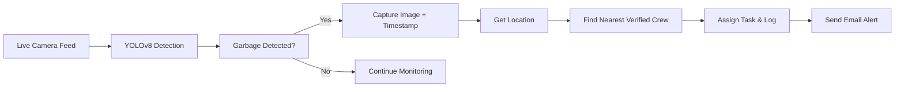

# ♻️ AI-Powered Waste Monitoring System

An intelligent real-time garbage detection and alert system using AI, live video feeds, and GPS-based crew assignment, aimed at transforming urban sanitation and cleanliness.

---

## 📌 Project Overview

The AI-Powered Waste Monitoring System automates the detection of garbage using CCTV or IP/mobile camera feeds and alerts cleaning crew in real-time. It uses YOLOv8 for object detection and Django for backend services to track, manage, and respond to hygiene issues efficiently across urban and institutional campuses.

---

## 💡 Features

- ✅ **Live Garbage Detection** via CCTV, IP, or mobile camera feed  
- 🗺️ **GPS & Location Tracking** with Google Maps integration  
- 📷 **Snapshot Capture** of the detected scene  
- ✉️ **Email Alerts** to the nearest available cleaning crew  
- 📋 **Admin Dashboard** to monitor crew, logs, complaints, and resource data  
- 🔄 **Automatic Task Assignment** using proximity and crew availability  
- 🧹 **Crew Verification & Salary Assignment** through admin panel  
- 🕒 **Detection Log History** and crew performance tracking  

---

## 🏗️ System Architecture



---

## 🧰 Technology Stack

| Layer            | Technologies Used                     |
|------------------|----------------------------------------|
| **Frontend**     | HTML, CSS, JavaScript                 |
| **Backend**      | Django, Django REST Framework         |
| **AI Model**     | YOLOv8 (Ultralytics)                  |
| **Live Feed**    | OpenCV                                |
| **Database**     | PostgreSQL                            |
| **Email Alerts** | SMTP (Gmail Integration)              |
| **Location APIs**| Google Maps + IPinfo                  |
| **Deployment**   | Localhost                             |

---

## 📁 Project Structure

```
Smart_Waste_Management/
│
├── swm_app/
│   ├── templates/
│   │   ├── index.html
│   │   └── adminHome.html
│   ├── static/
│   │   └── styles.css, adminHome.css
│   ├── models.py
│   ├── views.py
│   ├── urls.py
│   └── detection_scripts/
│       └── live_detection.py
│
├── media/
│   └── detections/
├── smart_waste_management_project/
│   └── settings.py, urls.py
├── manage.py
└── README.md
```

---

## 🚀 How to Run

1. **Clone the Repository**
   ```bash
   git clone https://github.com/nkale882/AI_Powered_Smart_Waste_Monitoring.git
   cd smart-waste-monitoring
   ```

2. **Create and Activate Virtual Environment**
   ```bash
   python -m venv venv
   source venv/bin/activate  # or venv\Scripts\activate on Windows
   ```

3. **Install Dependencies**
   ```bash
   pip install -r requirements.txt
   ```

4. **Set up PostgreSQL Database**
   - Create DB: `swm_db`
   - Update `settings.py` with your DB credentials

5. **Run Migrations**
   ```bash
   python manage.py makemigrations
   python manage.py migrate
   ```

6. **Start the Server**
   ```bash
   python manage.py runserver
   ```

7. **Access the Web App**
   Open [http://127.0.0.1:8000/](http://127.0.0.1:8000/) in your browser

---

## 📷 Run Real-Time Garbage Detection

```bash
python swm_app/detection_scripts/live_detection.py
```

Make sure:
- YOLOv8 model
- Email credentials are set correctly in `settings.py`
- Camera feed (local or mobile) is accessible

---

## 👨‍💻 Admin Functionalities

- View real-time detections
- Verify crew members and assign salaries
- Monitor complaint box and detection logs
- Assign tasks automatically or manually

---

## 🌍 Use Case

- Urban Municipal Corporations
- Institutional Campuses
- Airports, Malls, and Smart Cities
- Industrial Parks and SEZs

---

## 📈 Future Scope

- Add spill detection as a separate model  
- SMS and Telegram bot integration  
- Route optimization using Google Directions API  
- Predictive analytics for waste trends  

---

## 🔐 Credentials & Security

- Use **environment variables** for email and DB passwords  
- Enable 2FA and **App Password** for Gmail SMTP  
- Store `.pt` model file securely, avoid committing to Git  

---

## 📜 License

MIT License. Free to use and modify with credits.

---
